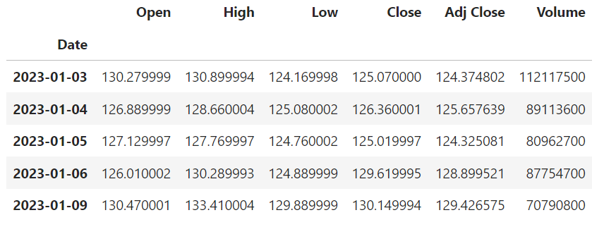
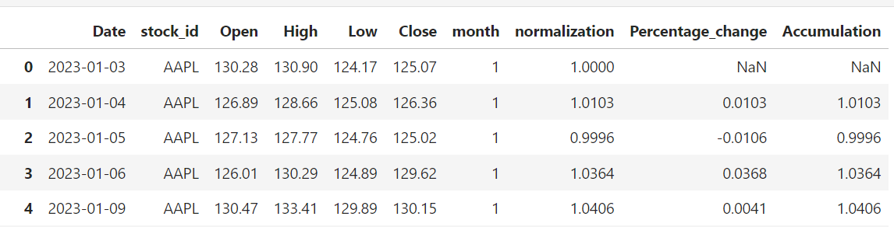
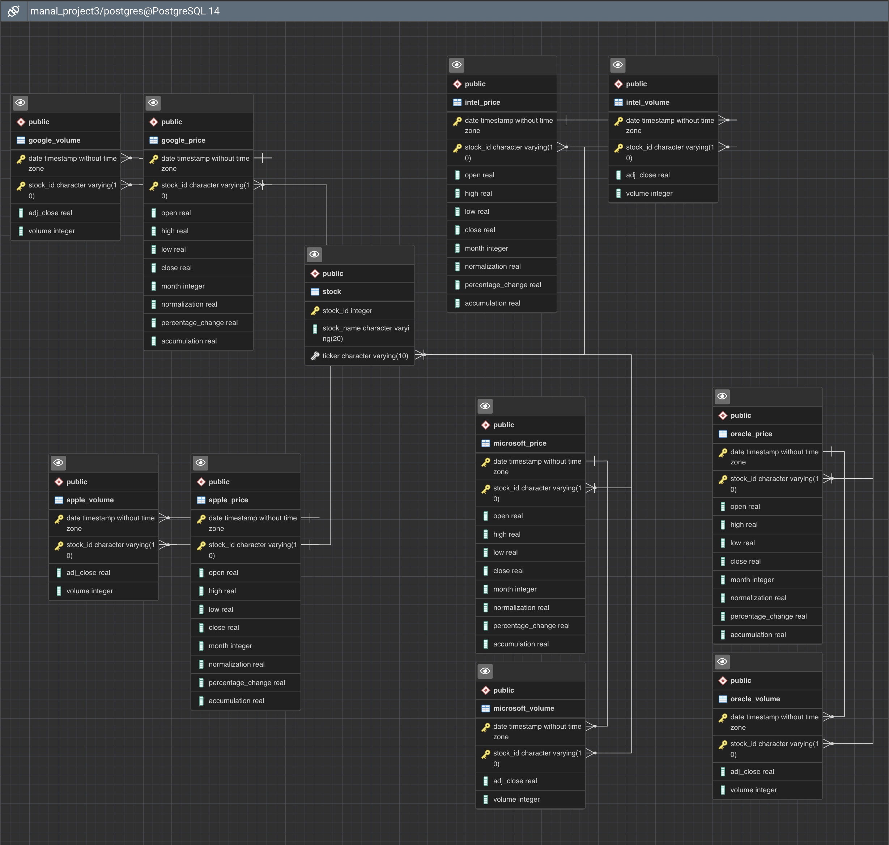
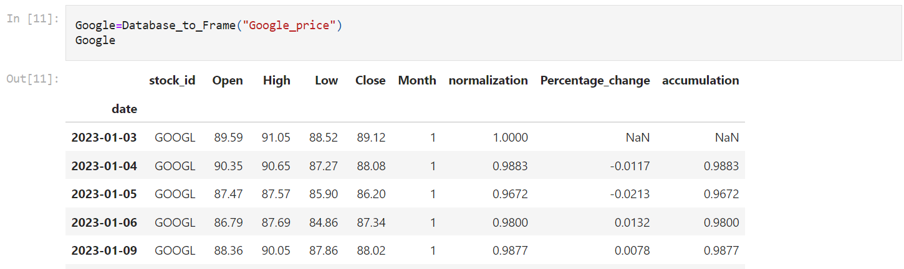
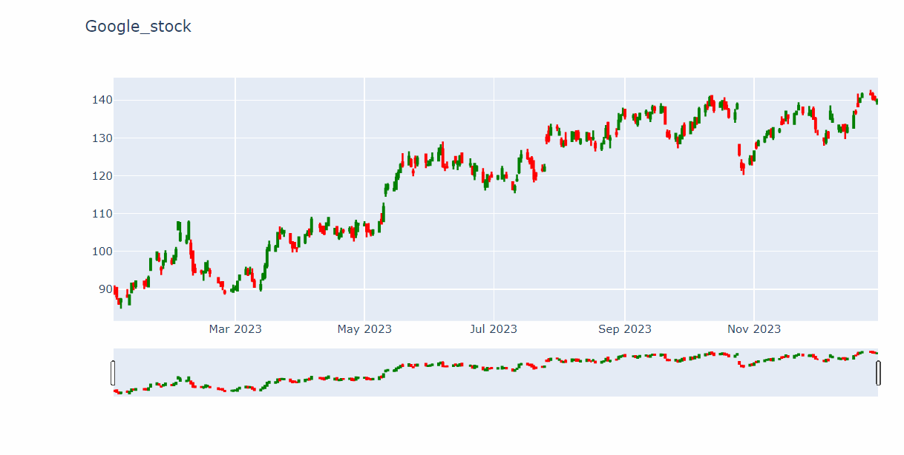
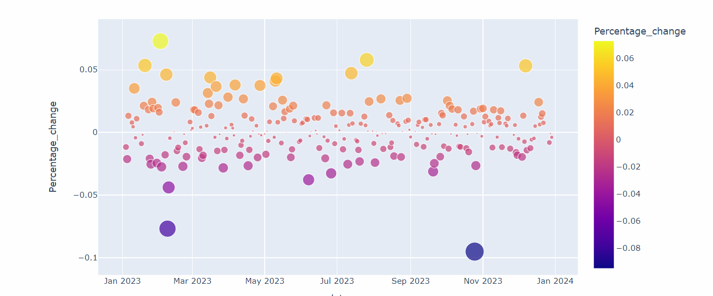

# Project 3 – The Use of Data Engineering to Analyze Stock Market 

# Project members: 
Manal Bayoumi, Rocio Cantu, and Melissa Mosby.

# Project Overview: 
Our project will analyze the stock data for different companies: Alphabet Inc. (aka Google), Apple Inc., Intel Corporation, Microsoft Corporation, and Oracle Corporation. Also, it will show the price and volume for these stocks on different dates. 

## That project will determine various questions when analyzing these stocks:
* How do investors pick up their stocks?
* In buying and selling stocks, do investors depend on the opening or the closing prices of stocks?
* What factors make stock prices rise or fall for a company like Apple, Google, Intel, Oracle, Microsoft?


* Our analysis will follow a data engineering track. We will employ jupyter notebook and pandas to capture and modify our data using ELT workflows. Next, we will feed our data into SQL. Also, we will generate an ERD diagram to show the relationships of our database tables. We will create a method to read our data from the database with pandas DataFrame.    

---
## Required Package Download
*Please run the following command in jupyter or bash terminal*
```bash
!pip install yfinance
!pip install pandas-datareader
!pip install streamlit --upgrade
!pip install plotly
```
## Instructions   
---
**Part One_ETL.ipynb**   
This is a jupyter notebook file, with this file, user can download stock data from Yahoo finance API and then save to SQLite3 database.   
Data from API include   
* data
* Open
* Close
* High
* Low 
* Volume      
To make it more efficent for analysing, use `ETL` to transform data, including
* Adding addtional column
   * stock_ticker: for easily identify stocks
   * normalization: for comparing different stock gain and loss
   * percentage_change: to determine which is the best and worst day to invest
   * accumulative_return: to determine how investor get return from the market
* Changing datatype for database to record
* remove redundant floating point.   
Original data of Apple example:   
   
Apple stock ready for database:   
  
After creating the database, please find here-beneath the ERD diagram   
    
---
**Part Two Database to Pandas**
This is a jupyter notebook file, at this stage, all data have already been loaded into database `Group_Project_3.db`. User can extract data using query tools or python sql packages to extract data to display.  
**With the sample code, user use pandas and sqlite library, extract data from database and display with dataframe**  
```python
# segment from cell 10,11
query=f"""SELECT name FROM PRAGMA_TABLE_INFO('{table_name}')"""
query=f"Select * from {table_name}"
sqlite3.engine.execute(query)
pd.DataFrame(value,columns=clean_column)

Google=Database_to_Frame("Google_price")
```
**DataFrame Sample**   
   
**Plotting Sample**   
  
   
From the previous picture    
* Google stock has total increase in 2023
* The largest gain day is February 2,2023. Investor gains 7%.
* The largest loss day is October 25,2023. Investor losses 9%.  
---
Part III Groupwebsite.py
For better user experience, our group build a interactive webpage with a streaming package not covered in the lecture called streamlit, this package use javascript plotly package build web.
Please make sure the following command run at least once to install the package
```bash
!pip install streamlit
```
Then run this command at the correct diretory
```bash
streamlit run Groupwebsite.py
```

## Run the web server
* navigate to the correct folder
* make sure you have run `Required Package Download` at least once
```python
streamlit run Groupwebsite.py
```

## There are several reasons why my group decided to use SQLite:
* SQLite is a SQL based database that can create a single database file that can easily be uploaded to GitHub and shared with other group members.
* SQLite facilities the work when using multiple databases. 
* We can DB Browser read SQLite file and check if the file performs well.
* SQLite is small like a paper; however, the other SQL is a big library. 
* Download DB Browser at this link https://sqlitebrowser.org.

## Why SQL is better than MongoDB?
* Using SQL over NoSQL in that project is better because stock databases are saved in a table form. SQL can perform analytical queries, such as filters, joins, merges, and aggression on the data. 
* SQL databases are better for multi-row transactions, while NoSQL is better for unstructured data (Smallcombe, 2023).

## Project Ethical Considerations:
* There are few ethical considerations made in the project since the data that we use is a public data.stream In dealing with data, the data analysts must be transparent when analyzing data free from biased. 

## References
* “Alphabet Inc. (GOOG) Stock Historical Prices & Data.” Yahoo! Finance, Yahoo!, 16 Jan. 2024, https://finance.yahoo.com/quote/GOOG/history?p=GOOG 
* “Apple Inc. (AAPL) Stock Historical Prices & Data.” Yahoo! Finance, Yahoo!, 16 Jan. 2024, https://finance.yahoo.com/quote/AAPL/history?p=AAPL
* “Intel Corporation Stock. (INTC) Stock Historical Prices & Data.” Yahoo! Finance, Yahoo!, 16 Jan. 2024, https://finance.yahoo.com/quote/INTC/history?p=INTC
* “Microsoft Corporation Stock. (MSFT) Stock Historical Prices & Data.” Yahoo! Finance, Yahoo!, 16 Jan. 2024, https://finance.yahoo.com/quote/MSFT/history?p=MSFT
* “Oracle Corporation Stock. (ORCL) Stock Historical Prices & Data.” Yahoo! Finance, Yahoo!, 16 Jan. 2024, https://finance.yahoo.com/quote/ORCL/history?p=ORCL
* Smallcombe, Mark. “SQL VS NOSQL: 5 Critical Differences.” Integrate.Io, 9 Nov. 2023, www.integrate.io/blog/the-sql-vs-nosql-difference/#two. 


